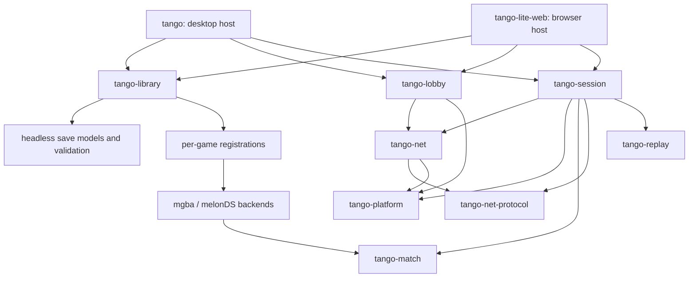

# Architecture

Tango has two hosts over the same library, lobby, session drivers, and
match engine. The desktop owns threads and native devices. The browser
pumps drivers from its event loop and supplies browser storage and audio.

## Dependencies

Arrows point from a consumer to the layer it uses. The frontends also use
the replay renderer, which takes an engine replay configuration and emits
video through `encoder-facade`.

| Layer | Owns | Does not own |
| --- | --- | --- |
| Frontends | Screens, input mapping, devices, scheduling, application effects | Rollback or game-specific binary layouts |
| Library | Game registry, catalogs, settings, loadout preparation, stats cache | Emulation and session lifetime |
| Lobby | Connection negotiation, readiness, committed settings/save exchange | Game registry, catalogs, emulation |
| Net / platform | Transport, reconnect, portable spawning and timers | Library, game backends, UI |
| Session | Portable drivers, audio streams, netplay supervision, session controls | Filesystem, UI toolkit, output devices, desktop worker threads |
| Match | Backend contracts, rollback coordination, telemetry, replay seeking and analysis | Network connections, frontend pacing, storage paths |
| Backend | Console emulation and linked-console operations | Application UI and library scans |
| Per-game support | Registration and game-specific engine hooks | Frontend orchestration |

`tango-gamesupport-common-dataview::model` owns save preparation, staged edits,
ROM overrides, and checksum-correct session snapshots. Per-game `-dataview`
crates own layouts, assets, custom edits, and structured validation findings.
`-ui` crates render these models and format findings as warnings. These remain separate because the browser
and headless consumers need parsing and emulation without the desktop UI.

## Game registration and features

`tango-library/src/game.rs` contains the one registration list. Each entry
names its core families and editor. `FAMILIES`, `GAMES`, lookup, localization,
and optional editor lookup derive from that list.

`Game` and `Family` are independent of UI features. The library's `ui`
feature enables each selected game's editor through Cargo's weak dependency
forwarding (`dependency?/ui`). Enabling UI alone adds no games. Desktop and
browser `gamesupport-*` flags both forward to the library; the desktop also
enables its `ui` feature.

## Desktop message flow

`main.rs` connects iced to `app::App`. `app/message.rs` defines the messages,
and `app/dispatch.rs` routes them and updates screen transitions. A tab
updates its local UI state and returns an effect when an action needs
application resources. The corresponding app feature module performs it.

| Task | Implementation |
| --- | --- |
| Selection, save operations, single-player/training launch | `app/play.rs` |
| Playback, queue, statistics, export | `app/replay.rs` |
| Download lifetime, cancellation, stale-result rejection | `app/downloads.rs` |
| Patch tab effects | `app/patches.rs` |
| Deferred playback, queue transitions, analysis job ownership | `app/replay_controller.rs` |
| Scan completion and selected-save reconstruction | `app/library.rs` |
| Lobby settings, compatibility, PvP handoff | `app/lobby.rs` |
| Session actions affecting preferences or the library | `app/sessions.rs` |
| Settings and welcome screen effects | `app/settings.rs` |
| Clipboard, file manager, window events, Discord | `app/desktop.rs` |

The app coordinates these features because they share the selected save,
library, configuration, and one active session. Download and replay controllers
own their workflow state. Feature handlers coordinate their results with
screens and the active session, using the existing iced message flow.

## Session ownership

1. A launcher resolves ROMs, saves, and patches, constructs a portable
   session, and starts its desktop workers.
2. It returns a `Launch` containing the runtime and its presentation data.
   While an asynchronous PvP launch is pending, the lobby stays visible.
3. `State::install` closes the old runtime, resets transient UI state,
   connects audio, and gives the new frame subscription a fresh identity.
4. `RunningSession` owns the session, audio, save backup, and worker handles.
   On drop it requests close, flushes the save, releases audio, drops the
   session to cancel drivers, and joins the workers.

That same teardown handles an abandoned lobby handoff, an error after only
some replay workers started, replacement, explicit close, and application
state destruction. A pending launch never binds the output device.
Post-match results survive session close so watching their replay can return
to the results screen.

The browser's `host.rs` composes explicit library, engine, and link handles
and supplies them to Dioxus through context. Each operation receives its
handle; the core state has no thread-local singleton. The engine owns its
audio sink and scheduling callbacks. Weak callback captures and listener,
worker, and audio guards release resources when the host goes away. Pending
match builds carry an attempt identity so a disconnect cannot install an
abandoned match. The browser uses the same portable session drivers.

## Netplay

`tango-lobby` depends on `tango-net` and `tango-platform`, independently of
library catalogs and emulator backends. Hosts resolve compatibility facts
(ROM availability, patch availability, compatibility tags) through the library
and pass those values to the lobby's pure verdict function.

A ready handshake yields `tango-net::handoff::PreMatchData`: cloneable
`MatchTerms` plus separately owned live `LinkParts`. Preparation consumes the
committed settings and saves; it does not need a network connection.
`tango-session::pvp::setup` attaches the prepared inputs to the live link.
Disable the session crate's default `netplay` feature for offline drivers.

- `pvp/driver.rs` boots the pair, advances rollback, publishes frames,
  records confirmed inputs, and finalizes the recording.
- `pvp/supervisor.rs` receives network input, watches the connection,
  reconnects, and announces orderly shutdown.
- `pvp/recording.rs` builds metadata and opens the host's replay store.
- `pvp/mod.rs` exposes controls, status, and shared state.

The host must call `Drive::finish` when a driver ends, so recordings receive
their final marker. The desktop's runtime loop and browser pump do this.
Completed match stats go to an optional host-supplied `StatsSink`. Replay
analysis returns stats to its host too. `tango-library::stats` handles cache
paths, encoding, and atomic writes through `Storage`; sessions never open
cache files. The desktop supplies both recording and stats adapters.

Simulation details and invariants are in
[the match-engine guide](tango-match/ARCHITECTURE.md).

## Loadout preparation

Both hosts use `tango-library::loadout::Resolver` for single-player, training,
and live matches. It resolves the exact game and patch, parses either the
saved file or an explicitly supplied snapshot, derives patched assets, and
returns structured validation findings without creating an editor or emulator.
Match preparation checks both committed simulation versions. A missing patch
fails the launch rather than silently running the clean ROM. Scanner guards
are released before patch I/O and asset preparation.

The editor's mutable save is separate from its session snapshot. Snapshotting
repairs checksums on a clone and never writes a save file. UI warning formatters
consume headless findings; they do not decide legality.

## Replay preparation

A replay stores inputs, so viewing, analyzing, or exporting it runs the game
again. Every consumer uses `tango-library::replays::resolve_roms` to:

1. Resolve both recorded seats against the game registry.
2. Check each recorded simulation version against its backend.
3. Load the clean scanned ROM and apply the exact recorded patch version.
4. Return games and ROM bytes in absolute player order.

The recording's local-player index changes perspective, never seat order.
Missing patches and incompatible simulations fail before emulation starts.
`rom::load` is also used for ordinary session launches. It releases the
scanner lock before patch I/O and leaves the clean cached ROM unchanged.

Storage and HTTP go through the library traits. Native adapters use the
filesystem and reqwest; the browser supplies an IndexedDB-backed memory
image and fetch. Save-editor previews can intentionally recover from a
missing patch; simulation input preparation cannot.

## Boundary checks

`tools/check_workspace.py --resolved` checks allowed crate edges and resolved
headless Cargo graphs. It also rejects direct filesystem persistence in
session code and thread-local core state in the browser. CI exercises offline
sessions, the standalone lobby/transport, and headless save preparation.
