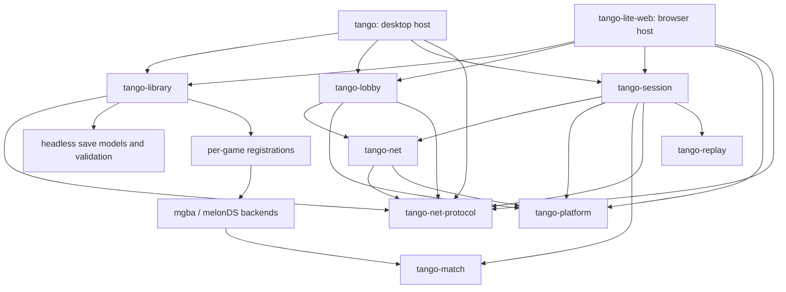

# Architecture

Tango has two hosts over the same library, lobby, session drivers, and
match engine. The desktop owns threads and native devices. The browser
pumps drivers from its event loop and supplies browser storage and audio.

## Dependencies

Arrows point from a consumer to the layer it uses. The frontends also use
the replay renderer, which takes an engine replay configuration and emits
video through `encoder-facade`. The library depends on
`tango-net-protocol` only for the wire game info and settings it reads and
builds, and the `compat::Facts` it returns to hosts. Both hosts build the
lobby's `Settings` from `tango-net-protocol` directly, and the browser uses
`tango-platform` for its timers. Neither host touches `tango-net`: the
lobby and the session drive the transport.

| Layer | Owns | Does not own |
| --- | --- | --- |
| Frontends | Screens, input mapping, host preferences (appearance, window, audio, netplay knobs), devices, scheduling, application effects | Rollback or game-specific binary layouts |
| Library | Game registry, catalogs, shared settings (paths, endpoints, selection memory), selection policy, save-file operations, loadout preparation, stats cache | Emulation and session lifetime |
| Lobby | Connection negotiation, readiness, committed settings/save exchange | Game registry, catalogs, emulation |
| Net / platform | Transport, reconnect, portable spawning and timers | Library, game backends, UI |
| Session | Portable drivers, audio streams, netplay supervision, session controls, priming status, frame-delay rules, multi-screen arrangement geometry | Filesystem, UI toolkit, output devices, desktop worker threads |
| Match | Backend contracts, rollback coordination, telemetry, replay seeking and analysis | Network connections, frontend pacing, storage paths |
| Backend | Console emulation and linked-console operations | Application UI and library scans |
| Per-game support | Registration and game-specific engine hooks | Frontend orchestration |

`tango-gamesupport-common-dataview::model` owns save preparation, staged edits,
ROM overrides, and checksum-correct session snapshots. Per-game `-dataview`
crates own layouts, assets, custom edits, and structured validation findings.
`-ui` crates render these models and format findings as warnings. These remain separate because the browser
and headless consumers need parsing and emulation without the desktop UI.

## Game registration and features

`tango-library/src/game.rs` contains the one registration list. Each entry
names its core families and editor. `FAMILIES`, `GAMES`, lookup, localization,
and optional editor lookup derive from that list.

`Game` and `Family` are independent of UI features. The library's `ui`
feature enables each selected game's editor through Cargo's weak dependency
forwarding (`dependency?/ui`). Enabling UI alone adds no games. Desktop and
browser `gamesupport-*` flags both forward to the library; the desktop also
enables its `ui` feature.

## Desktop message flow

`main.rs` connects iced to `app::App`. `app/message.rs` defines the messages,
and `app/dispatch.rs` routes them and updates screen transitions. A tab
updates its local UI state and returns an effect when an action needs
application resources. The corresponding app feature module performs it.
Tabs do no I/O: a replay's save previews, for instance, load off the UI
thread from the replays tab's `LoadPreview` effect. The session screen
follows the same rule (see [Session ownership](#session-ownership)).
`window.rs` holds the offered resolutions and the minimum size; `main.rs`
restores the saved geometry within the largest surface the GPU device
accepts, and `app/dispatch.rs` caps and persists it as the window changes.
`app/view.rs` renders the shell.
`main.rs` only boots iced (fonts, window geometry) after deciding whether
this process is the crash supervisor: `platform/crash/supervisor.rs` owns
log rotation and the out-of-process minidump server, and
`platform/crash/client.rs` installs the child's panic hook and native crash
handler, which does no allocation or stderr I/O.

| Task | Implementation |
| --- | --- |
| Selection changes, save-operation effects, single-player/training launch | `app/play.rs` |
| Playback, queue, statistics, replay save previews, export requests | `app/replay.rs` |
| Export thread and progress stream | `replay_render.rs` |
| Download lifetime, cancellation, stale-result rejection | `app/downloads.rs` |
| Patch tab effects | `app/patches.rs` |
| Deferred playback, queue transitions, analysis job ownership | `app/replay_controller.rs` |
| Scan completion and selected-save reconstruction | `app/library.rs` |
| Lobby settings, compatibility, PvP handoff | `app/lobby.rs` |
| Session effects: preference writes, clip export, watching replays | `app/sessions.rs` |
| Settings effects (data folder, updater) and welcome screen effects | `app/settings.rs` |
| Clipboard, file manager, external links, window events, Discord | `app/desktop.rs` |

`tango_library::config::Config` holds only what both hosts read: the data
and cache paths, the matchmaking and patch endpoints, and the selection
memory (last game and family, save per family, patch per save, match type per
family, favorite patches). `tango/src/config.rs` owns every other setting,
including nickname, language, and frame delay (clamped on load), and
`flatten`s the library struct into it. `config.json` stays one flat object with the
keys the single-struct config wrote; tests there pin its key set and round trip.

The loadout strip (`tabs/play/loadout_strip.rs`) and `tabs/play/save_manage.rs`
hold only pickers, form state, and views. What a pick does, and every
save-file rule, is library code (see [Loadout preparation](#loadout-preparation)).

The app coordinates these features because they share the selected save,
library, configuration, and one active session. Download and replay controllers
own their workflow state. Feature handlers coordinate their results with
screens and the active session, using the existing iced message flow.

## Session ownership

1. A launcher resolves ROMs, saves, and patches, constructs a portable
   session, and starts its desktop workers.
2. It returns a `Launch` containing the runtime and its presentation data.
   While an asynchronous PvP launch is pending, the lobby stays visible.
3. `State::install` closes the old runtime, resets transient UI state,
   connects audio, and gives the new frame subscription a fresh identity.
4. `RunningSession` owns the session, audio, save backup, and worker handles.
   On drop it requests close, flushes the save, releases audio, drops the
   session to cancel drivers, and joins the workers.

`session::State::update` applies a session message and returns an optional
`session::update::Effect`, like a tab. `session/update/{pvp,replay,training}`
hold the controls: what each message does to the live session and the
presentation state it acts on (the PvP setup drawers and telemetry history,
the replay scrub bar). `session/results.rs` cooks a finished match into the
results card, `stylus.rs` folds pointer events into a DS touch, and the
launch loads the game's backdrop art (`backdrop.rs`) so drawing never reads
a file. `session/view` only renders: `frame.rs` presents the frames,
`hud.rs` the floating chrome every kind shares, `priming.rs` the priming
notice, and one module per session kind composes them. The App performs the
effects: it persists preferences the session changed (frame delay, pane
widths, opponent view, replay input display, custom-screen speedup), starts
or cancels clip exports, watches replays, and skips to the next queued one.
Closing a session resets its presentation to the defaults in one step; only
the install counter, the frame revisions, and the results card survive.

`tango-match::screens::Arrangement` is the one geometry for presenting a
multi-screen composition: the desktop maps its DS stacking and primary
screen settings onto it, the browser always stacks vertically, and both
re-pack frames and place the stylus area through it. The video exporter
stacks each seat through the same `Arrangement::STACKED`, in place.

A playback session that should double as its replay's analysis is built with
`want_stats`; the desktop's prefetch thread reports the fold through its own
`PrefetchStatsFeed` channel. Single-player, training, and replay share the
session crate's `local::Pacing` speed dial (replay layers its transport
preset and custom-screen speedup on top), and training and replay share its
`local::Surfaces` display. Every session derives its native frame rate from
its game.

Single-player save write-back is decided by
`tango-session::singleplayer::SaveWriteback`: it refuses a cart image that
does not parse as a save, keeps the file's tail, and skips unchanged images.
Each host schedules the checks and performs the write.

That same teardown handles an abandoned lobby handoff, an error after only
some replay workers started, replacement, explicit close, and application
state destruction. A pending launch never binds the output device.
Post-match results survive session close so watching their replay can return
to the results screen.

The browser's `host.rs` composes explicit library, engine, and link handles
and supplies them to Dioxus through context. Each operation receives its
handle; the core state has no thread-local singleton. The library handle
holds the same `tango-library::Catalog` and library config as the desktop,
without the desktop's preferences, and the shell records every selection
change in that config. The engine owns its
audio sink and scheduling callbacks. Weak callback captures and listener,
worker, and audio guards release resources when the host goes away. Pending
match builds carry the lobby's handoff ticket, so a disconnect cannot
install an abandoned match. The browser uses the same portable session drivers.

## Netplay

`tango-lobby` depends on `tango-net` and `tango-platform`, independently of
library catalogs and emulator backends. Hosts resolve compatibility facts
(ROM availability, patch availability, compatibility tags) with
`tango-library::Catalog::compatibility_facts`. The fact type,
`tango-net-protocol::compat::Facts`, sits below both crates, so the library
returns it and the lobby consumes it unchanged.

After every lobby report and every local change, both hosts call
`State::reconcile`, passing their Settings builder and fact resolver. It
resends Settings with deduplication, withdraws readiness when the verdict is
not Compatible, and returns any patch the host should fetch.
`State::apply_default_match_type` and `State::pick_match_type` hold the
match-type policy. Hosts supply the per-family memory from the config's
`last_match_type_per_family` and record each pick there.

`tango_lobby::LinkIdent::parse` turns what the user typed into a
matchmaking code or a `/host`/`/connect` direct role.
`tango-net::open_channels` performs every bring-up: signaling rendezvous or
direct host/connect, channel bundling (including which side offered, and
whether ICE settled on a relay), and version negotiation. It is used by
the lobby's `connect`/`connect_direct` and by `Link::reconnect`. Its typed
`ConnectError` maps into `tango_lobby::Error`, a thiserror enum whose variants
name each failure. Hosts map them to localized text; variants without their
own text use their `Display` in the generic failure template.

A ready handshake yields `tango-net::handoff::PreMatchData`: cloneable
`MatchTerms` plus separately owned live `LinkParts`. `State::take_pre_match`
hands it over with a `HandoffTicket`, and the host settles its session build
with `State::complete_handoff`: a build for a lobby the user has since left
is dropped, a failure parks in the lobby's status line, and a success clears
the lobby for the match. Preparation consumes the
committed settings and saves; it does not need a network connection. Hosts
build each `tango-session::pvp::Seat` (game, patched ROM, SRAM image) from
the library's `ResolvedLoadout`, whose `match_sram` is the parsed save dumped
in the game's own layout; the session never parses a save.
`tango-session::pvp::PvpSession::new` attaches the prepared seats to the
live link.
Disable the session crate's default `netplay` feature for offline drivers.

- `pvp/driver.rs` boots the pair, advances rollback, publishes frames,
  records confirmed inputs, and finalizes the recording.
- `pvp/supervisor.rs` receives network input, watches the connection,
  reconnects, and announces orderly shutdown.
- `pvp/recording.rs` builds metadata and opens the host's replay store.
- `pvp/mod.rs` exposes controls, status, and shared state.

`tango-session::Priming` (from `dyn Session::priming`) reports where a
session stands on its priming walk, for both hosts' notices.
`pvp::clamp_frame_delay` and `pvp::initial_frame_delay` are the frame-delay rules.

The host must call `Drive::finish` when a driver ends, so recordings receive
their final marker. The desktop's runtime loop and browser pump do this.
Completed match stats go to an optional host-supplied `StatsSink`. Replay
analysis returns stats to its host too. `tango-library::stats` handles cache
paths, encoding, and atomic writes through `Storage`; sessions never open
cache files. The desktop supplies both recording and stats adapters.

Simulation details and invariants are in
[the match-engine guide](tango-match/ARCHITECTURE.md).

## Loadout preparation

`tango-library::Catalog` bundles the ROM, save, patch, and replay scanners.
Both hosts rescan through it (`Catalog::list`, then `rescan`, `rescan_library`,
or `rescan_replays`), and build preparation inputs with `Catalog::resolver`,
`Catalog::open_replay`, and `Catalog::compatibility_facts` rather than
assembling them by hand.

`tango-library::loadout::Selection` is the one selection policy. It holds the
family, game, save, and patch overlay, and changes only through its pick
methods, which keep them consistent with each other and the catalog. It
restores from and persists to the config's per-family save memory and
per-save patch memory. The desktop's pickers and the browser's library screen
both drive it; the browser additionally calls `reconcile` after rescans.

`tango-library::save` owns save-file operations over `Storage`: template
lookup (patch templates override bundled ones), creation, duplication,
renaming, deletion, name sanitizing and disambiguation, and game detection.
Hosts only format labels.

Both hosts use `tango-library::loadout::Resolver` for single-player, training,
and live matches, and for save-editor previews. It resolves the exact game and patch, parses either the
saved file or an explicitly supplied snapshot, derives patched assets, and
returns structured validation findings without creating an editor or emulator.
Match preparation checks both committed simulation versions. A missing patch
fails the launch rather than silently running the clean ROM. Scanner guards
are released before patch I/O and asset preparation.

`Resolver::preview` prepares a save for the editor best-effort: a patch that
fails to apply previews the clean ROM instead. `Resolver::preview_replay_seat`
does the same for one seat of a recording, after checking its simulation
version. The desktop's `selection.rs` only attaches the editor.

The editor's mutable save is separate from its session snapshot. Snapshotting
repairs checksums on a clone and never writes a save file. UI warning formatters
consume headless findings; they do not decide legality.

## Replay preparation

A replay stores inputs, so viewing, analyzing, or exporting it runs the game
again. Every consumer opens one with `tango-library::Catalog::open_replay`
(`replays::open`), which reads and decodes it through `Storage`, then
resolves its ROMs with `replays::resolve_roms` to:

1. Resolve both recorded seats against the game registry.
2. Check each recorded simulation version against its backend.
3. Load the clean scanned ROM and apply the exact recorded patch version.
4. Return games and ROM bytes in absolute player order.

The recording's local-player index changes perspective, never seat order.
`tango-session::replay::EngineReplay` then validates the recording and builds
the engine configuration that playback, analysis, and export share.
Missing patches and incompatible simulations fail before emulation starts.
`rom::load` is also used for ordinary session launches. It releases the
scanner lock before patch I/O and leaves the clean cached ROM unchanged.

Storage and HTTP go through the library traits. Native adapters use the
filesystem and reqwest; the browser supplies an IndexedDB-backed memory
image and fetch. Save-editor previews (`Resolver::preview`) can intentionally
recover from a missing patch; simulation input preparation cannot.

## Boundary checks

`tools/check_workspace.py --resolved` checks the allowed direct crate edges
of every shared layer and the resolved headless Cargo graphs. It also rejects direct filesystem persistence in
session code and thread-local core state in the browser. CI exercises offline
sessions, the standalone lobby/transport, and headless save preparation.
